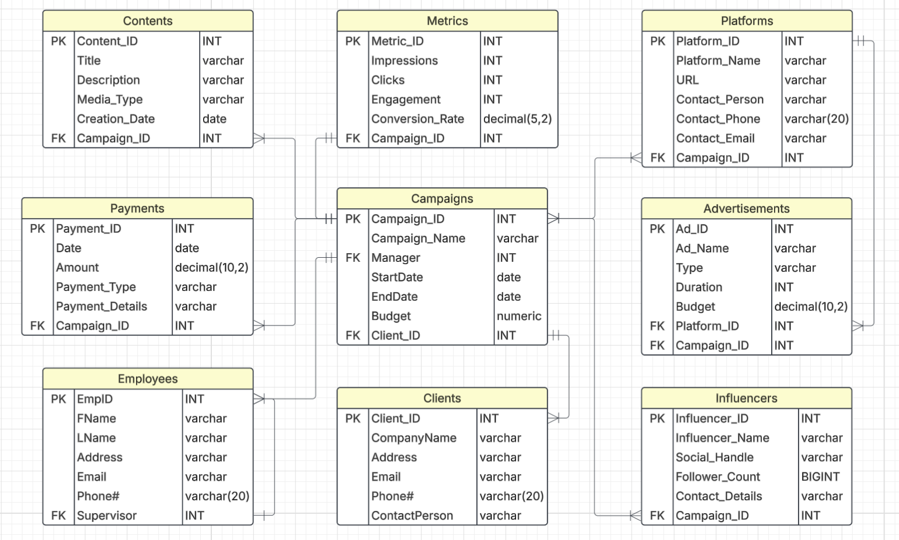
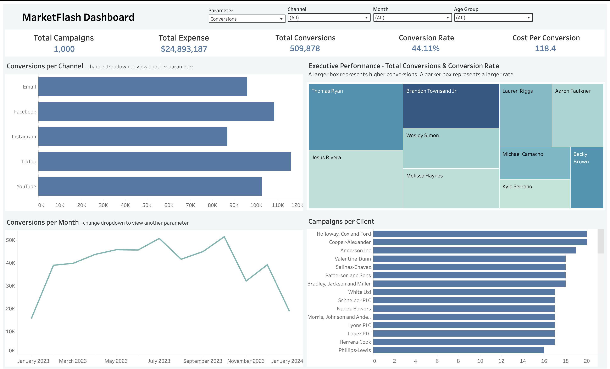

# 📊 MarketFlash: Scalable Marketing Analytics System

**Role:** Data Analyst & BI Developer  
**Tools Used:** SQL, Beekeeper Studio, Tableau, Google Sheets  

---

## 📚 Table of Contents
- [Summary](#project-summary)
- [ERD](#entity-relationship-diagram-erd)
- [SQL Setup](#sql-database)
- [Dashboard](#tableau-dashboard)
- [Presentation](#project-presentation)
- [Key Takeaways](#key-takeaways)

---

## 🧠 Project Summary

In this project, I worked as a data analyst for **MarketFlash**, a growing marketing agency. I was tasked with building a scalable database and an interactive Tableau dashboard to replace their outdated spreadsheet system. This project demonstrates my ability to design a relational database from scratch, work with stakeholder requirements, and turn raw marketing data into actionable business insights.

---

## 🎯 Business Context

Markus, the founder of MarketFlash, needed:
- A structured **database** to store all 2023 campaign data.
- A clear, **interactive dashboard** for his team to make timely business decisions.
- **Cost and performance insights** across platforms and clients.

---

## 📐 Entity-Relationship Diagram (ERD)

The database is structured with the following entities:
- **Campaigns**
- **Clients**
- **Employees**
- **Platforms**
- **Influencers**
- **Content**
- **Payments**
- **Metrics**
- **Advertisements**

---

## 🛠️ SQL: Database Design & Queries

### 📂 Table Creation
Full SQL scripts to create tables and enforce data integrity:
- [Create Tables Script](https://www.notion.so/Table-Creation-SQL-Queries-22452541c16580eabc16e139a995c74a?source=copy_link)

### 📂 Sample Data Inserts
Includes 5+ entries per table:
- [Data Entry](https://www.notion.so/Sample-Data-Entry-22452541c16580d48fedc9cbb0fc95d2?source=copy_link)

### 📂 Example Queries
Business insights from SQL queries:
- Average cost per click (CPC)
- Average cost per conversion
- [Example Queries](https://www.notion.so/Sample-Queries-22452541c16580229c4bc8d7fadd57a9?source=copy_link)

---

## 📊 Tableau Dashboard

A fully interactive Tableau dashboard was created for campaign tracking and decision-making.  
Key features:
- KPIs: Campaigns, Expenses, Conversions, Conversion Rate, Cost per Conversion
- Filters by parameters(conversions, expenses, clicks, likes, views), channel, month, age group
- Visual breakdown of cost and performance by campaign and platform

### 📸 Dashboard Preview

### 🔗 

---

## 📋 Project Presentation

- Summary presentation given to the client (Markus)
- Includes ERD, SQL structure, example queries, and dashboard insights

📄 [Download Presentation](presentation/MarketFlash.pdf)

---

## ✅ Key Takeaways

- Designed a scalable SQL database with 10+ normalized tables
- Created stakeholder-specific Tableau dashboards for real-time insights
- Applied real-world business logic to transform marketing operations

---
